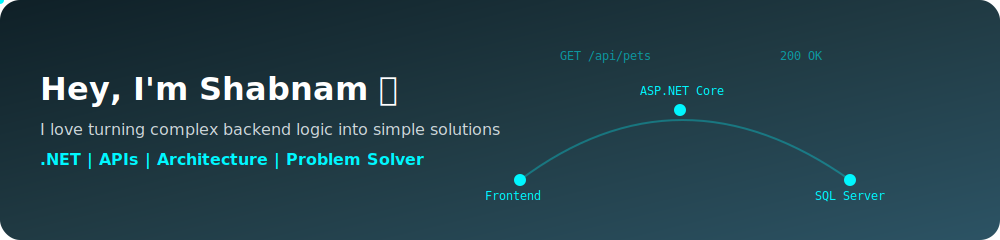

<!-- BANNER -->

  

---

<!-- TYPING ANIMATION -->

  

---

### 👩‍💻 About Me

- 💡 Passionate about building clean and maintainable backend systems  
- 🧠 Strong understanding of N-Tier & Onion Architecture  
- 🛠️ Working with ASP.NET Core & Web APIs  
- 🎯 Goal: Becoming a developer who can both build and teach  

---

### ⚙️ Tech Stack

---

### 📊 GitHub Stats

  

---

### 🚀 Featured Project

## 🐾 Pet Care Management System

A scalable backend system built with ASP.NET Core, focused on clean architecture and real-world API design.

---

### ⚙️ Tech Stack
ASP.NET Core • Web API • MVC • Entity Framework Core • MS SQL Server  

---

### 🔑 Highlights
- Designed using Onion Architecture  
- Built 40+ RESTful API endpoints  
- Implemented JWT Authentication  
- Applied FluentValidation & AutoMapper  
- Used Generic Repository Pattern  

---

### 📌 Architecture
This project follows Onion Architecture to ensure separation of concerns and maintainability.

---

### 🔗 Explore the Project

---

### 🐍 Contribution Snake

  

---

### ✨ Let's Connect

---

⭐️ Always learning, always building.
